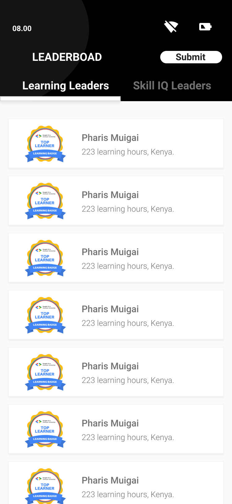

  <h3 align="center">GAADS ANDROID PRACTICE PROJECT</h3>
  
  

    Google Africa scholarship practice test.  
   And extra description.
     
     
     
    

 

### Table of contents

**1 [About the App](#about-the-app)** 
**2 [General Preview](#general-preview)** 
**3 [Technical](#technical)** 
**4 [Work in Progress](#work-in-progress)** 
**5 [Contributing](#contributing)** 
**6 [License](#license)** 
**7 [Versions](#versions)** 
**8 [Contributers](#contributers)** 

:point_down: :point_down: :point_down: :point_down: :point_down:

## About the app

Google Africa scholarship practice test phase 2. Android application built with Kotlin to display a LeaderBoard on top learners and their skills.

## General Preview

#### Screenshots of the app

 

##### Learners:

##### Or Skills:

##### Submit Project:
 

#### Play Store

Coming Soon

## Technical

## Permissions

1. Internet
2. Browse phone

#### Running the project
You can:

    a. clone the project and compile it yourself in android studio(Most up to date)
    b. Run the already compiled version on the(the proect comes with an apk folderwith various apk versions), 
    c. You can check it out already compiled at Google Play(Mostly the one that is last to be published.)
        Downoad it here: [Download App](https://play.google.com/store/apps/details?id=com.package.path)

## Package Structure
    
    com.kevinmainaiurngu.GAADTEST    # Root Package
    .
    ├── data                # For data handling.
    │   ├── local           # Local Persistence Database. Room (SQLite) database
    |   │   ├── dao         # Data Access Object for Room   
    │   ├── remote          # Remote Data Handlers     
    |   │   ├── api         # Retrofit API for remote end point.
    │   └── repository      # Single source of data.
    |
    ├── model               # Model classes
    |
    ├── di                  # Dependency Injection             
    │   ├── builder         # Activity Builder
    │   ├── component       # DI Components       
    │   └── module          # DI Modules
    |
    ├── ui                  # Activity/View layer
    │   ├── base            # Base View
    │   ├── main            # Main Screen Activity & ViewModel
    |   │   ├── adapter     # Adapter for RecyclerView
    |   │   └── viewmodel   # ViewHolder for RecyclerView   
    │   └── details         # Detail Screen Activity and ViewModel
    |
    └── utils               # Utility Classes / Kotlin extensions

## Architecture
This app uses [***MVVM (Model View View-Model)***](https://developer.android.com/jetpack/docs/guide#recommended-app-arch) architecture.

### TECHNICAL

#### How to use

**1. Required to run project:**
       ` - To run this project use Android studio 3.* and later. It will be less messy.
         - Gradle version used: gradle 4.0. You can use multiple gradle versions vby having them stored offline. [You can read this to set it up.](www.sth)
        `

**2. Clone this repository :**
 
         `git clone https://github.com/kevinmainairungu/GAADTEST`
         
**3. open Project in Android Studio

**4. Build Project**

**5. Incase of an eror when building project, update your gradle version, Build Tools download**

#### Dependencies
Picasso
Glide
Gson
Timber
RecyclerView
Retrofit

## To Do List

- [x] Multi-Activity 
- [x] View pager
- [x] Customizing Toolbar
- [x] RecyclerView
- [x] Making Network Request
- [x] Working with Google Form
- [x] Api Requests
- [ ] push to store

#### CONTRIBUTING
### Assets

[Resources](https://drive.google.com/drive/folders/1l-huMnFzu0Lh_olBCzHgovsUCwbKouMb)

### List of the Contributors on GitHub
* [Contributors](https://github.com/kevinmainairungu/GAADTEST/graphs/contributors)

### Want to contribute?
I would/ We'd love to have your help in making  **{this app (replace with name of your project)}** better. The project is still very incomplete, but if there's an issue you'd like to see addressed sooner rather than later, let me(/us) know. 

Before you contribute though read the contributing guide here: [COntributing.md](https://github.com/kevinmainairungu/GAADTEST/contributing.md)

For any concerns, please open an [issue](https://github.com/kevinmainairungu/GAADTEST/issues), or JUST, [fork the project and send a pull request](https://github.com/YourUserNameHere/ProjectName/pulls). 

## License 
* see [LICENSE](https://github.com/kevinmainairungu/GAADTEST/LICENSE.md) file

## Versions 
* Version 1.0  DATE 11/9/2020

## Contributers
For personal feedback or questions feel free to contact me via the mail address, which is mentioned on my [Github profile](link (https://github.com/kevinmainairungu). If you have found any bugs or want to post a feature request please use the [bugtracker](https://github.com/kevinmainairungu/GAADTEST/issues) to report them.

#### Developer
* e-mail: mainairungu99@gmail.com
* Twitter: [@maina_irungu_](https://twitter.com/maina_irungu_ "maina_irungu_")

